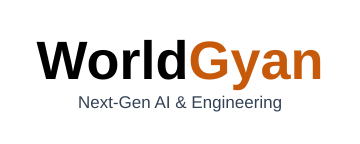

<!-- Generated from profile.config.json. Edit the source, then run npm run generate. -->

  
  
  
  
  

**Established expertise:** Frontend architecture, Angular, TypeScript, RxJS and NgRx; enterprise UI engineering, component systems and automated testing.

**Currently building:** Public engineering studies and teaching examples in Angular, reactive workflows, state management and TypeScript.

**Exploring and researching:** AI architecture, Agentic AI, AI orchestration and LLM-powered applications; tool integration, evaluations and human review.

### Selected engineering projects

Public learning projects and code references, selected after reviewing their implementations.

- [**Angular architecture study**](https://github.com/AshutoshChoubey/angular-interview-worldgyan.com) — Study guides and TypeScript examples for Angular signals, HTTP interceptors, authentication flows and application architecture.

- [**RxJS operator lab**](https://github.com/AshutoshChoubey/rxjs-interview-worldgyan.com) — Angular demonstrations comparing switchMap, mergeMap, concatMap and exhaustMap, with a reactive search example.

- [**NgRx effects demo**](https://github.com/AshutoshChoubey/ngrxeffects) — An Angular PokéAPI example connecting store actions, reducers and HTTP side effects to list and detail views.

- [**TypeScript type-system examples**](https://github.com/AshutoshChoubey/typescript-interview-worldgyan.com) — Focused examples of generics, unions, mapped types and utility types, alongside a type-system study reference.

 

- [Frontend system design](https://worldgyan.com/technology/frontend-system-design/) — Micro-frontends, integration boundaries and enterprise scaling tradeoffs.
- [AI engineering research](https://worldgyan.com/technology/production-ai-engineering/) — Published research on architecture, retrieval, serving and evaluation.
- [Angular Testing — WorldGyan](https://www.youtube.com/playlist?list=PLqQyE6QNucSfUIpucL_nx7vDuwAa1A_VH) — Practical testing tutorials on the official YouTube channel.

### 🌌 Explore More Themes

- [**Obsidian Architect Edition**](./themes/obsidian-architect/README.md)

<b>📐 Architectural Specification &amp; Responsive Fallbacks</b>

<picture>
  <source media="(prefers-reduced-motion: reduce) and (max-width: 900px)" srcset="./assets/rendered/static/1a4d826df8db/hero-mobile.svg">
  <source media="(prefers-reduced-motion: reduce)" srcset="./assets/rendered/static/ef2b9703f9b0/hero.svg">
  <source media="(max-width: 900px)" srcset="./assets/rendered/96d9a1d4c129/hero-mobile.svg">
  
</picture>

**Ashutosh Kumar Choubey · Software Engineer | System Design | AI Orchestration**

Building scalable frontend systems. Exploring intelligent, agent-powered software.

<picture>
  <source media="(prefers-reduced-motion: reduce) and (max-width: 900px)" srcset="./assets/rendered/static/cce821112ced/expertise-mobile.svg">
  <source media="(prefers-reduced-motion: reduce)" srcset="./assets/rendered/static/2b4b139111b8/expertise.svg">
  <source media="(max-width: 900px)" srcset="./assets/rendered/81659348a649/expertise-mobile.svg">
  
</picture>

<picture>
  <source media="(prefers-reduced-motion: reduce) and (max-width: 900px)" srcset="./assets/rendered/static/03bbd1e35f14/technology-mobile.svg">
  <source media="(prefers-reduced-motion: reduce)" srcset="./assets/rendered/static/023dea640ced/technology.svg">
  <source media="(max-width: 900px)" srcset="./assets/rendered/801faa005b3a/technology-mobile.svg">
  
</picture>

<picture>
  <source media="(prefers-reduced-motion: reduce) and (max-width: 900px)" srcset="./assets/rendered/static/9719c72acc87/ai-systems-mobile.svg">
  <source media="(prefers-reduced-motion: reduce)" srcset="./assets/rendered/static/827f07c90255/ai-systems.svg">
  <source media="(max-width: 900px)" srcset="./assets/rendered/46820306bbac/ai-systems-mobile.svg">
  
</picture>

<picture>
  <source media="(prefers-reduced-motion: reduce) and (max-width: 900px)" srcset="./assets/rendered/static/56d69706f545/research-mobile.svg">
  <source media="(prefers-reduced-motion: reduce)" srcset="./assets/rendered/static/28a25a9d8999/research.svg">
  <source media="(max-width: 900px)" srcset="./assets/rendered/06e407e1cc76/research-mobile.svg">
  
</picture>

*Preserved Classic Minimal Theme specification is documented in [Classic Engineering Minimal Theme](./themes/classic-engineering/README.md).*

<picture>
  <source media="(prefers-reduced-motion: reduce) and (max-width: 900px)" srcset="./assets/rendered/static/72e54942992f/connect-mobile.svg">
  <source media="(prefers-reduced-motion: reduce)" srcset="./assets/rendered/static/fb938fa18060/connect.svg">
  <source media="(max-width: 900px)" srcset="./assets/rendered/71c1f5b19c16/connect-mobile.svg">
  
</picture>

[GitHub](https://github.com/AshutoshChoubey) · [LinkedIn](https://www.linkedin.com/in/ashutosh-kumar-choubey) · [Professional Portfolio](https://me.worldgyan.com/) · [WorldGyan](https://worldgyan.com/) · [YouTube](https://www.youtube.com/@WorldGyan)
